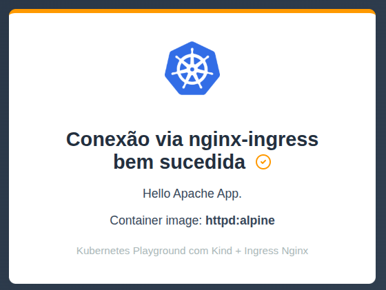
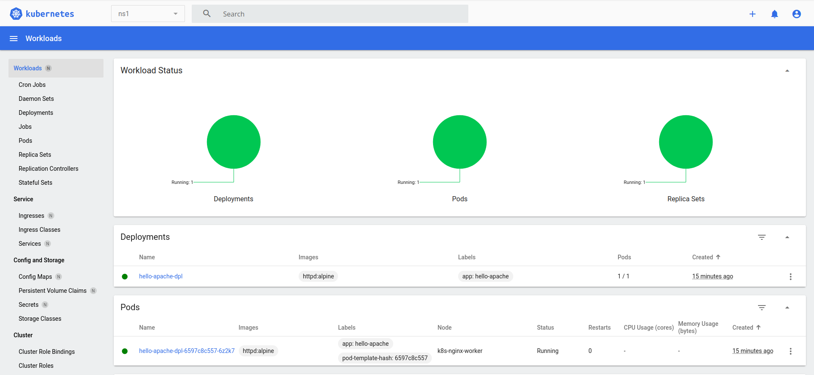

# GreenCap K8s

## Descrição

Este projeto fornece um ambiente completo de estudos, desenvolvimento e testes para Kubernetes:

- **Vagrant**: Provisionamento da VM
- **Kind**: Kubernetes in Docker
- **Ingress**: Nginx
- **Container Registry**: Harbor para gerenciamento de imagens Docker
- **Banco de Dados**: PostgreSQL com interface pgAdmin
- **Aplicação de Exemplo**: API FastAPI em Python conectando ao PostgreSQL
- **Dashboard**: Kubernetes Dashboard para monitoramento
- **Aplicação Web**: Hello Apache App para demonstração
- **Stack de Observabilidade**: Prometheus + Grafana + Jaeger para monitoramento completo
- **Automação**: Scripts de provisionamento e configuração

O ambiente é ideal para desenvolvedores que precisam de um playground completo para testar aplicações Kubernetes, incluindo registry de containers, banco de dados, aplicações de exemplo e monitoramento avançado com métricas, logs e traces distribuídos.

## Pré-requisitos

- [Vagrant](https://www.vagrantup.com/)
- [VirtualBox](https://www.virtualbox.org/) (ou outro provider compatível com Vagrant)

## Como usar

1. **Clone o repositório:**
   ```sh
   git clone git@github.com:greencapk8s/greencap-k8s.git
   cd greencap-k8s
   ```

2. **Suba o ambiente:**

   - **Local com Vagrant:**
     ```sh
     # Com GUI
     ./create-environment.sh --gui --memory 8192 --cpus 4
     
     # Sem GUI
     ./create-environment.sh --no-gui --memory 4096 --cpus 2
     ```

     Acesso a máquina virtual via ssh:
     ```sh
     vagrant ssh
     ```
   
   - **AWS EC2 (via Terraform):**
     ```sh
     # Deploy simples
     ./create-environment.sh --aws --key-name my-key
     
     # Deploy com recursos personalizados
     ./create-environment.sh --aws --instance-type t3a.large --region us-east-1 --key-name my-key
     ```

## Validação de Funcionamento

- **Com interface gráfica (GUI):**
  1. Após acessar a máquina virtual via VirtualBox, abra o navegador Firefox instalado na VM.
     - Usuário padrão da VM: **vagrant**
     - Senha padrão da VM: **vagrant**
  2. **Hello Apache App**: Acesse http://domain.local:30001/hello-apache/
     - Você deve ver a página de boas-vindas do Hello Apache App
     - 
  3. **Kubernetes Dashboard**: Acesse https://domain.local:30002/
     - Token de acesso: `/home/vagrant/playground/dash-token` na VM
     - 

- **Somente terminal (sem GUI):**
  1. Acesse a VM com `vagrant ssh`
  2. **Teste Hello Apache App**:
     ```sh
     curl -v http://domain.local:30001/hello-apache/
     ```
     
## Referências

- [Kind - Kubernetes IN Docker](https://kind.sigs.k8s.io/)
- [Ingress Nginx Controller](https://kubernetes.github.io/ingress-nginx/)
- [Vagrant](https://www.vagrantup.com/)
- [Prometheus](https://prometheus.io/)
- [Grafana](https://grafana.com/)
- [Jaeger](https://www.jaegertracing.io/)
- Projeto inspirado em: [README.md original de mascosta](https://github.com/mascosta/docs/blob/main/kind-ingress-nginx/README.md)
