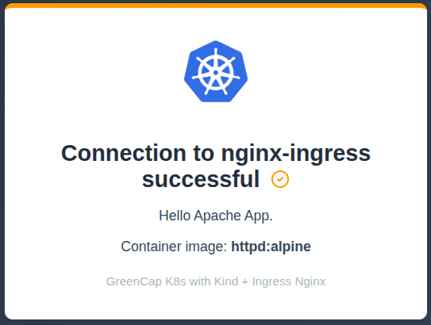

[](./docs/readme-translations/index/pt-br/README.md)

# GreenCap K8s

## Description

GreenCap is a project that provides a complete environment for Kubernetes studies, development and testing:

It is ideal for developers who need a complete playground to test Kubernetes applications including: container registry, database, monitoring, logs, ci/cd(gitlab) and much more.

Some tools that make up the platform:

- **Kind**: Kubernetes in Docker
- **Ingress**: Nginx
- **Container Registry**: Harbor for Docker image management
- **Database**: PostgreSQL with pgAdmin interface
- **Sample Application**: FastAPI Python API connecting to PostgreSQL
- **Dashboard**: Kubernetes Dashboard for monitoring
- **Web Application**: Hello Apache App for demonstration
- **Observability Stack**: Prometheus + Grafana + Jaeger for complete monitoring
- **Git**: GitLab
- **CI/CD**: GitLab

## Pre-requirements:

- [Vagrant](https://www.vagrantup.com/)
- [VirtualBox](https://www.virtualbox.org/) (or another Vagrant-compatible provider)

## How to Use:

1. **Clone the repository:**
   ```sh
   git clone git@github.com:greencapk8s/greencap-k8s.git
   cd greencap-k8s
   ```

2. **Start the environment:**

   - **Local with Vagrant (with GUI by default):**
     ```sh
     ./greencap.sh --vagrant --memory 8192 --cpus 4
     
     # Or with default settings (4GB RAM, 2 CPUs)
     ./greencap.sh --vagrant
     ```

     Access the virtual machine via ssh:
     ```sh
     vagrant ssh
     ```
   
   - **AWS EC2 (via Terraform):**
     
     By default, terraform plan is executed:
     
     ```sh
     ./greencap.sh --aws --instance-type t3a.xlarge --region <region> --key-name <ec2-key-pair> --public-ip <your-public-ip> --ami-id <ubuntu-ami>
     ```

     To apply, add the parameter(`--auto-approve`) at the end of the command:

     ```sh
     ./greencap.sh --aws --instance-type t3a.xlarge --region <region> --key-name <ec2-key-pair> --public-ip <your-public-ip> --ami-id <ubuntu-ami> --auto-approve
     ```

## Operation Validation:

- **Via Graphical Interface (GUI):**
  1. Access the virtual machine via VirtualBox.
     - Default VM user: **vagrant**
     - Default VM password: **vagrant**
  2. **Hello Apache App**: Access http://domain.local:30001/hello-apache/
     - You should see the Hello Apache App welcome page
     - 
  3. **Kubernetes Dashboard**: Access https://kubernetes-dashboard.greencap:30002/
     - Access token: `/home/vagrant/greencap/dash-token` on the VM
     - 

- **Via Terminal (SSH):**
  1. Access the VM with `vagrant ssh`
  2. **Test Hello Apache App**:
     ```sh
     curl -v http://domain.local:30001/hello-apache/
     ```
     
## Environment Cleanup:

To completely remove/clean the created environment (virtual machine, files, images), use the `--clean` parameter:

#### **Vagrant Environment:**

```sh
./greencap.sh --clean --vagrant
```

This command will destroy the VM.

#### **AWS Environment (Terraform/EC2)**

```sh
./greencap.sh --clean --aws
```

This command will execute Terraform destroy and remove provisioned AWS resources (instances, disks, etc).

#### **Local Environment (without Vagrant/AWS)**
If you performed the installation directly on your local machine (outside of Vagrant or AWS), clean it with:

```sh
./greencap.sh --clean --local-debug
```

This command will delete the cluster created with Kind.

## References

- [Kind - Kubernetes IN Docker](https://kind.sigs.k8s.io/)
- [Ingress Nginx Controller](https://kubernetes.github.io/ingress-nginx/)
- [Vagrant](https://www.vagrantup.com/)
- [Prometheus](https://prometheus.io/)
- [Grafana](https://grafana.com/)
- [Jaeger](https://www.jaegertracing.io/)
- [Postgres](https://www.postgresql.org/docs/)
- [pgAdmin](https://www.pgadmin.org/docs/)
- [Gitlab](https://docs.gitlab.com/)
- [mascosta](https://github.com/mascosta/docs/blob/main/kind-ingress-nginx/README.md)
