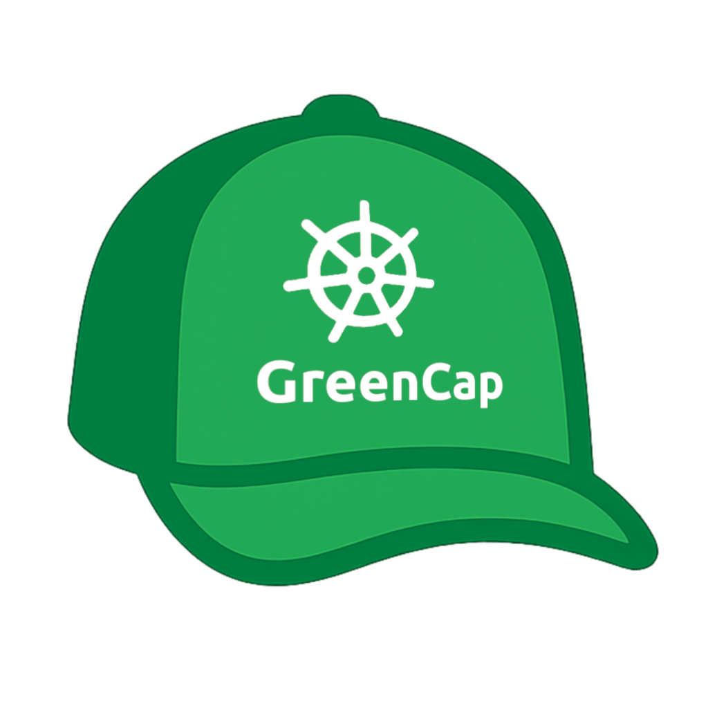
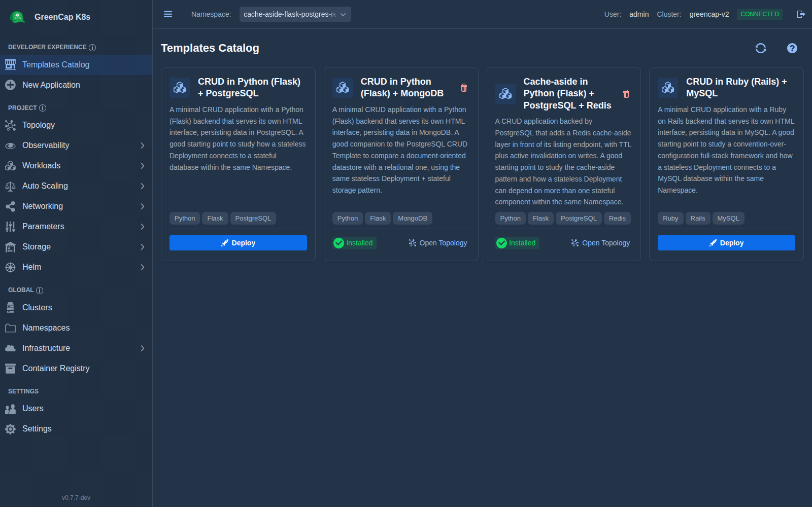
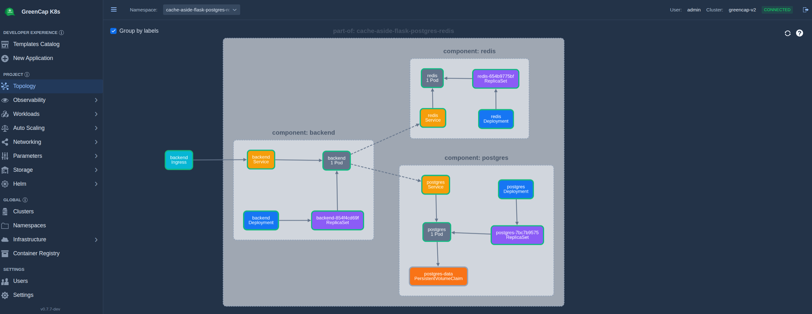
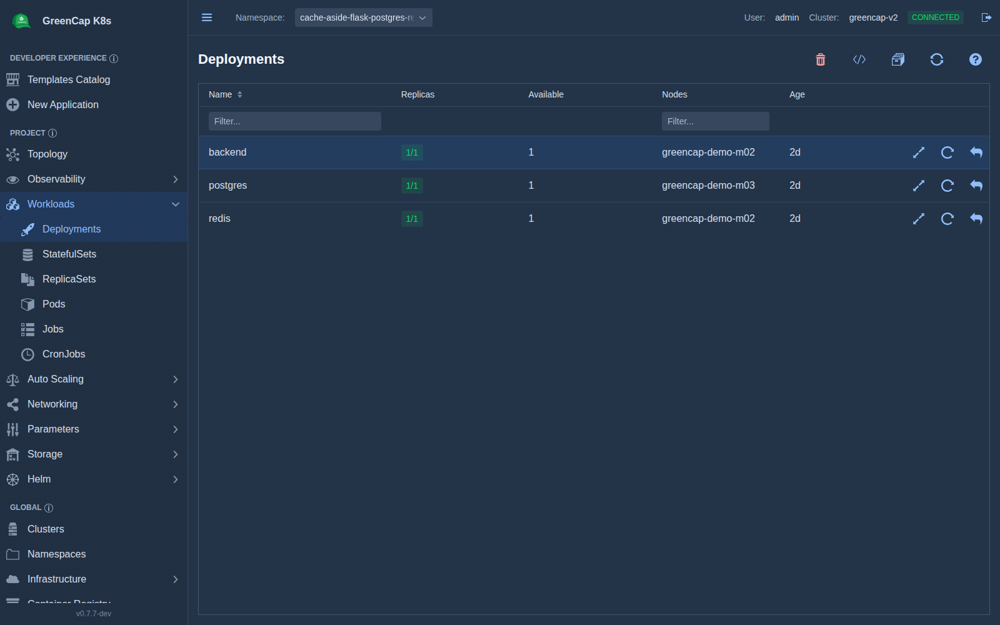

<div align="center">
  
  <h1>GreenCap K8s</h1>
  <p><strong>Simple Kubernetes cluster management.</strong></p>
  <p>A lightweight web platform to run and operate Kubernetes. One command brings up a local cluster with GreenCap on it — ready to study, build, and test — and you can connect clusters you already run.</p>

  <p>
    <a href="LICENSE"></a>
    
    
    
    
  </p>

  <p>
    <a href="https://www.greencapk8s.dev">Website</a> ·
    <a href="#quick-start">Quick Start</a> ·
    <a href="CONTEXT.md">Domain &amp; Docs</a> ·
    <a href="https://github.com/greencapk8s/greencap-k8s/issues">Issues</a>
  </p>
</div>

---

## What is GreenCap?

GreenCap is a web platform for **operating Kubernetes through a UI instead of a terminal**. One command (`./setup/setup.sh`) brings up a local cluster with GreenCap running on it — the fastest way to start. You can also connect clusters you already run: minikube, kind, managed, or on-prem.

It's built for a specific audience: **individuals and small/medium teams who study, develop, and test against Kubernetes**, and want the day-to-day operations without the operational weight of an enterprise platform.

- **Two layers, one install.** `setup.sh` provisions a local cluster to get you started; the app itself is a management layer over clusters — it operates what lives inside them, it is not a cluster lifecycle tool.
- **It's not read-only.** GreenCap actively creates, deletes, scales, restarts, and deploys — every action governed by the acting user's Kubernetes RBAC.
- **It's multi-user and RBAC-native.** Each non-admin user is backed by a Kubernetes ServiceAccount; their access is exactly what Kubernetes RBAC grants — nothing more.

## See it in action

**Browse and one-click-deploy curated example apps from the Templates Catalog**



**See how an application's resources connect — including inferred service dependencies**



**Operate your workloads — scale, restart, roll back, inspect, read logs**



## Why GreenCap?

- **Zero to running in one command** — `./setup/setup.sh` provisions a real Kubernetes cluster (via minikube) and deploys GreenCap into it. The only prerequisite is Docker.
- **The whole resource surface, one UI** — Workloads, Networking, Storage, Config, Autoscaling, Nodes, Events, and Metrics: browse and operate them all in one place.
- **Deploy without hand-writing YAML** — four guided wizards: from a container image, from a Docker Compose file, from a Dockerfile (built in-cluster via Kaniko), or from a Helm chart.
- **See how things connect** — an interactive topology graph mapping ownership, routing, storage, and even inferred service-to-service dependencies.
- **Batteries included** — an in-cluster image registry with builds, Helm releases & repositories, Operator management via OLM, and a catalog of one-click example apps.

## Features

**Clusters &amp; Access**
- Register clusters via kubeconfig, or API server URL + bearer token
- Multi-user, governed entirely by Kubernetes RBAC — per-user ServiceAccounts
- Live connection-status monitoring per cluster

**Workloads**
- Deployments, StatefulSets, ReplicaSets, Pods, Jobs, CronJobs
- Scale, restart, rollback, trigger, suspend/resume, cordon, delete
- Live pod logs — including a previous-instance view for diagnosing CrashLoopBackOff

**Deploy**
- **Deploy Application** — from a container image
- **Import Compose** — translate a `docker-compose.yml` into Kubernetes resources
- **Deploy from Dockerfile** — build in-cluster with Kaniko, then deploy
- **Deploy from Helm** — install a chart as a release

**Topology**
- Interactive graph: ownership, routing, storage, and ingress relationships
- Inferred service dependencies (e.g. a backend pointing at its database's Service)
- Layouts saved per user + cluster + namespace

**Developer Experience**
- **Templates Catalog** — one-click deploy of curated example applications
- **Kubernetes Operators** — install and manage via OLM
- **Registry** — an in-cluster image registry with source-to-image builds

**Observability &amp; more**
- Dashboard, Events, and Pod metrics (top-pods)
- Networking (Services, Ingresses), Config (ConfigMaps, Secrets), Storage (PVCs, PVs, StorageClasses), Autoscaling (HPA), Nodes
- Edit any supported resource as YAML — Manifest → Apply

## Quick Start

The only prerequisite is **Docker**. Everything else (`kubectl`, `minikube`, `helm`, `openssl`) is detected and, if missing, the wizard offers to install it for you (Linux &amp; macOS).

```bash
git clone https://github.com/greencapk8s/greencap-k8s.git
cd greencap-k8s
./setup/setup.sh
```

The wizard provisions a real Kubernetes cluster (minikube), builds and deploys GreenCap into it, and wires up local access. When it finishes:

- **URL:** http://greencap.local
- **Login:** `admin` / `admin` &nbsp;(change it after your first login)

To tear everything down:

```bash
./setup/teardown.sh
```

> Want to work on the code (local build, Docker Compose, demo environment)? See the [developer guide](.dev/README.md).

## The story

GreenCap started in September 2025 as a terminal tool. Ten months and 100+ sprints later, it's a full web platform — designed, built, and documented in the open, one vertical slice at a time. The domain lives as a ubiquitous language in [`CONTEXT.md`](CONTEXT.md), and every significant decision is recorded as an [Architecture Decision Record](docs/adr/).

## Architecture

| Layer | Technology |
|-------|------------|
| Backend | Java 21 · Spring Boot 3.3 |
| UI | Vaadin Flow 24 (server-driven — no separate frontend) |
| Persistence | PostgreSQL 16 · Flyway · Spring Data JPA |
| Kubernetes | Fabric8 Kubernetes Client |
| Packaging | Docker — a single, plug-and-play monolith |

Go deeper:
- [`CONTEXT.md`](CONTEXT.md) — the domain language
- [`docs/adr/`](docs/adr/) — architectural decision records
- [`.dev/README.md`](.dev/README.md) — developer guide

## Security

- **Encrypted kubeconfig** — cluster credentials are always encrypted before they are persisted.
- **Native Kubernetes RBAC** — each non-admin user acts through their own ServiceAccount, so every action is authorized by the cluster itself.
- **One source of truth** — GreenCap does not maintain a parallel permission system. What Kubernetes RBAC grants is exactly what the user can do.

Found a vulnerability? See [SECURITY.md](SECURITY.md).

## Contributing

Contributions are welcome — bug reports, feature ideas, docs, and code. Start with the [contributing guide](CONTRIBUTING.md), and please review our [Code of Conduct](CODE_OF_CONDUCT.md).

## License

Released under the [Apache License 2.0](LICENSE).

---

<div align="center">
  <sub>If GreenCap is useful to you, consider leaving a ⭐ — it genuinely helps the project grow.</sub>
</div>
