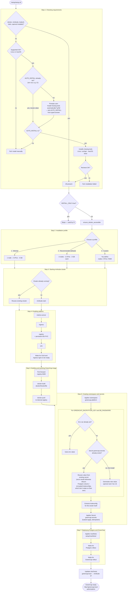

# `setup.sh` Workflow

Diagram of the interactive wizard run by `./setup/setup.sh` (see [main README](../README.md)).

```mermaid
flowchart TD
    Start(["./setup/setup.sh"]) --> Step1

    subgraph Step1["Step 1: Checking requirements"]
        direction TB
        C1{"docker, minikube, kubectl,<br/>helm, openssl installed?"}
        C1 -->|"no"| OSCheck{"Supported OS?<br/>Linux or macOS"}
        C1 -->|"yes"| OK1["All present"]

        OSCheck -->|"yes"| PreSet{"AUTO_INSTALL already set?<br/>(env var, e.g. CI)"}
        OSCheck -->|"no"| FailInstall["Fail: install manually"]

        PreSet -->|"yes, reuses value"| CaseCheck{"AUTO_INSTALL=y?"}
        PreSet -->|"no"| ReadPrompt["Prompts user:<br/>'Install missing tools automatically? [y/N]'<br/>→ sets AUTO_INSTALL from typed answer"]
        ReadPrompt --> CaseCheck

        CaseCheck -->|"yes"| Install["Installs missing tools<br/>Linux: curl/apt · macOS: brew"]
        CaseCheck -->|"no"| FailInstall

        Install --> Recheck{"Recheck OK?"}
        Recheck -->|"yes"| OK1
        Recheck -->|"no"| Fail3["Fail: installation failed"]
    end

    OK1 --> InstallOnly{"INSTALL_ONLY=true?"}
    InstallOnly -->|"yes"| EndInstallOnly(["Stops — used by CI"])
    InstallOnly -->|"no"| DockerCheck["ensure_docker_accessible"]

    DockerCheck --> Step2

    subgraph Step2["Step 2: Installation profile"]
        Profile{"Choose a profile"}
        Profile -->|"1 · Minimal"| P1["1 node · 2 CPUs · 4 GB"]
        Profile -->|"2 · Recommended (default)"| P2["3 nodes · 2 CPUs · 3 GB each"]
        Profile -->|"3 · Custom"| P3["You define<br/>nodes / CPUs / RAM"]
    end

    P1 --> Step3
    P2 --> Step3
    P3 --> Step3

    subgraph Step3["Step 3: Starting minikube cluster"]
        Running{"Cluster already running?"}
        Running -->|"yes"| Reuse["Reuses existing cluster"]
        Running -->|"no"| MkStart["minikube start"]
    end

    Reuse --> Step4
    MkStart --> Step4

    subgraph Step4["Step 4: Enabling addons"]
        direction TB
        A1["metrics-server"] --> A2["ingress"]
        A2 --> A3["registry<br/>+ persistent 8Gi PVC"]
        A3 --> A4["olm"]
        A4 --> Wait["Waits for OLM and<br/>ingress-nginx to be ready"]
    end

    Wait --> Step5

    subgraph Step5["Step 5: Building and pushing GreenCap image"]
        PF["Port-forward<br/>registry:5000"] --> Build["docker build<br/>docker/Dockerfile"]
        Build --> Push["docker push<br/>to internal registry"]
    end

    Push --> Step6

    subgraph Step6["Step 6: Creating namespace and secrets"]
        direction TB
        NS["Applies namespace<br/>greencap-platform"] --> KeyCheck

        subgraph KeyCheck["For GREENCAP_ENCRYPTION_KEY and DB_PASSWORD"]
            direction TB
            EnvSet{"Env var already set?"}
            EnvSet -->|"yes"| UseEnv["Uses env value"]
            EnvSet -->|"no"| SecretExists{"Secret greencap-secrets<br/>already exists?"}
            SecretExists -->|"yes"| ReuseSecret["Reuses value from<br/>existing secret<br/>(rerun would otherwise desync<br/>Postgres volume / encrypted kubeconfigs,<br/>which don't rotate on their own)"]
            SecretExists -->|"no, first install"| Generate["Generates new value<br/>openssl rand -hex 16"]
        end

        KeyCheck --> Kubeconfig["Extracts kubeconfig<br/>for the cluster itself"]
        Kubeconfig --> Secret["Applies Secret<br/>greencap-secrets<br/>(kubectl apply, idempotent)"]
    end

    Secret --> Step7

    subgraph Step7["Step 7: Deploying Postgres and GreenCap"]
        Apply["Applies manifests<br/>setup/manifests/"] --> RolloutPG["Waits for<br/>Postgres rollout"]
        RolloutPG --> RolloutGC["Waits for<br/>GreenCap rollout"]
    end

    RolloutGC --> Hosts["Updates /etc/hosts<br/>greencap.local → minikube IP"]
    Hosts --> Done(["GreenCap ready<br/>http://greencap.local<br/>admin/admin"])
```
